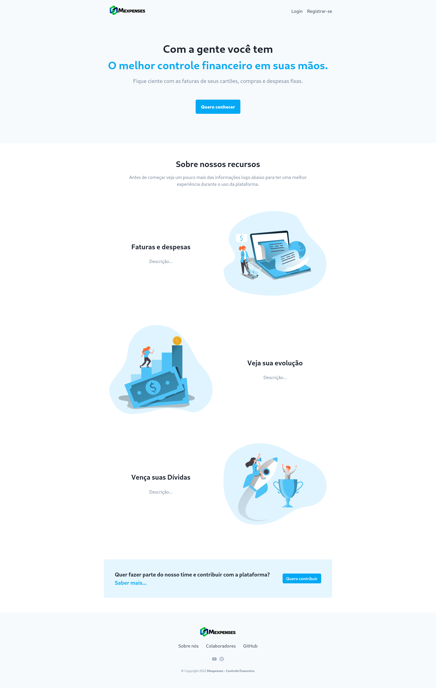

# Landing Page - Mexpenses (NEXT.JS)

TCC <b>Aplicação Web para seu controle financeiro pessoal.</b> Atualmente colaborando como Designer UX/UI e Front-end no projeto. <a href="https://fatecgarca.cps.sp.gov.br/"><em>Fatec Garça - Deputado Julio Julinho Marcondes de Moura</em></a>

- <em>Contribuidor oficial: <a href="https://github.com/HectorFront">@Hector Silva</a>&nbsp;&nbsp;</em> 
- <em>Suporte: <a href="https://github.com/yara-leodoro">@Yara Leodoro</a>&nbsp;&nbsp;</em> 
- <em>Suporte: <a href="https://github.com/MayconMoreira">@Maycon Moreira</a></em>  
- __Plataforma__: https://github.com/HectorFront/Mexpenses

## Capturas de tela:

